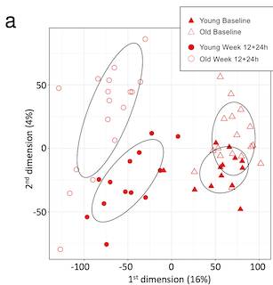

# VB013: source code

### Fig. 2a
  
Fig. 2a: [R code [MD]](code/20201007_VB013.mdsNorm.Rmd)  

### RNA-Seq analysis
code:  
- preprocessing: [[MD]](code/20171232_VB013.preproc.md)  

input:
- non-normalized (raw) gene counts: [[CSV]](input/vb013.genecounts.csv)  
- sample annotation: [[XLSX]](input/sampleSheet.vSF.xlsx)  
- alignment QC metrics: [[TSV]](input/vb013.ReadStats.txt)  
- Rhesus Mmul_8 genome annoation: [[GTF]](https://github.com/sekalylab/vb013/releases/download/v0.0.1/Mmul_8.genes.gtf)  

output:
- raw SeqExpressionSet: [[RDA]](output/vb013.esetRaw.RData)  
- normalized SeqExpressionSet: [[RDA]](output/vb013.eset.RData)  
- pre-vaccination substracted SeqExpressionSet: [[RDA]](output/vb013.esetBaselined.RData)
- DGEGLM list: [[RDA]](output/vb013.fits.RData), [[RDA]](output/vb013.fits2.RData)  
