VB013 bulk RNA-Seq preprocessing
================
Slim Fourati
12 November, 2021

Load required packages

``` r
suppressPackageStartupMessages(library(package = "knitr"))
suppressPackageStartupMessages(library(package = "parallel"))
suppressPackageStartupMessages(library(package = "readxl"))
suppressPackageStartupMessages(library(package = "survival"))
suppressPackageStartupMessages(library(package = "EDASeq"))
suppressPackageStartupMessages(library(package = "edgeR"))
suppressPackageStartupMessages(library(package = "sva"))
suppressPackageStartupMessages(library(package = "ComplexHeatmap"))
suppressPackageStartupMessages(library(package = "tidyverse"))
```

Set session options

``` r
options(stringsAsFactors       = FALSE,
        mc.cores               = detectCores() - 1,
        readr.show_col_types   = FALSE,
        dplyr.summarise.inform = FALSE)
workDir <- dirname(getwd())
opts_chunk$set(tidy = FALSE, fig.path = "../figure/")
ht_opt$message <- FALSE
```

Read raw counts

``` r
countDF <- read_csv(file = file.path(workDir, "input/vb013.genecounts.csv")) %>%
  column_to_rownames(var = "geneid") %>%
  as.data.frame()
```

Read sample annotation

``` r
sampleSheetFile <- file.path(workDir, "input/sampleSheet.vSF.xlsx")
sampleSheetDF <- read_excel(path      = sampleSheetFile) %>%
  mutate(sampleID = gsub(pattern = "_", replacement = "-", sampleID),
         study = gsub(pattern = "VB103", replacement = "VB013", study)) %>%
  as.data.frame()
```

Read TOA

``` r
challengeFile <- file.path(workDir, "input/Table for sample randomization miRNA .xlsx")
challengeDF <- read_excel(path = challengeFile,
                          skip = 2) %>%
  mutate(ADJUVANT = gsub(pattern = "IGF1", replacement = "IGF-1", ADJUVANT)) %>%
  select(`ANIMAL ID`, VACCINE, ADJUVANT, `Time of acquisition (TOA)`, AGE,
         ROUTE, GENDER) %>%
  distinct()
```

Append TOA to sample annotation

``` r
samplesAnnot <- merge(x     = challengeDF,
                      y     = sampleSheetDF,
                      by.x  = "ANIMAL ID",
                      by.y  = "patientID",
                      all.y = TRUE) %>%
  mutate(rowname = sampleID) %>%
  column_to_rownames(var = "rowname") %>%
  as.data.frame()
samplesAnnot <- samplesAnnot[colnames(countDF), ]
# add total reads counted
samplesAnnot$TotalReads <- colSums(countDF)
```

Read feature annotation

``` r
colNames <- c("seqname",
              "source",
              "feature",
              "start",
              "end",
              "score",
              "strand",
              "frame",
              "attribute")
colTypes <- paste(c(rep("c", times = 3),
                    rep("i", times = 2),
                    rep("c", times = 4)),
                  collapse = "")
documentsDir <- file.path(workDir, "input")
featuresAnnotationFile <- "Mmul_8.genes.gtf"
skipNb <- read_lines(file = file.path(documentsDir, featuresAnnotationFile))
skipNb <- sum(grepl(pattern = "^#", skipNb))

featuresAnnot <- read_tsv(file      = file.path(documentsDir,
                                                featuresAnnotationFile),
                          skip      = skipNb,
                          col_names = colNames,
                          col_types = colTypes)
# extract gene_id and transcript_id from attributes
featAnnot <- featuresAnnot %>%
  mutate(gene_id = gsub(pattern = ".*gene_id \"([^;]+)\";.+",
                        replacement = "\\1",
                        attribute),
         gene_name = ifelse(test = grepl(pattern = "gene_name",
                                         attribute),
                            yes = gsub(pattern = ".+gene_name \"([^;]+)\";.+",
                                       replacement = "\\1",
                                       attribute),
                            no  = NA),
         gene_biotype = ifelse(test = grepl(pattern = "gene_biotype",
                                         attribute),
                            yes = gsub(pattern = ".+gene_biotype \"([^;]+)\";.*",
                                       replacement = "\\1",
                                       attribute),
                            no  = NA)) %>%
  select(seqname, strand, gene_id, gene_name, gene_biotype) %>%
  distinct() %>%
  as.data.frame()
rownames(featAnnot) <- featAnnot$gene_id
featAnnot <- featAnnot[rownames(countDF), ]
```

Create raw SeqExpressionSet

``` r
# build  raw ExpressionSet
esetRaw <- newSeqExpressionSet(counts      = as.matrix(countDF),
                               featureData = AnnotatedDataFrame(featAnnot),
                               phenoData   = AnnotatedDataFrame(samplesAnnot))
save(esetRaw, file = file.path(workDir, "output/vb013.esetRaw.RData"))
```

Plot alignment metrics

``` r
statDF <- read_tsv(file      = file.path(workDir, "input/vb013.ReadStats.txt"),
                   col_names = FALSE) %>%
  distinct() %>%
  spread(X3, X2)
plotDF <- counts(esetRaw) %>% 
  colSums() %>%
  data.frame(Counted = .) %>%
  rownames_to_column() %>%
  merge(x = statDF, by.x = "X1", by.y = "rowname")

plotDF <- plotDF %>%
  mutate(Trimmed    = TotalReads - Surviving,
         NotMapped  = Surviving - UniqMapped - Multimapped,
         NotCounted = UniqMapped + Multimapped - Counted) %>%
  select(Trimmed, NotMapped, NotCounted, Counted, X1) %>%
  gather(key, value, -X1)
ggplot(data = plotDF,
                   mapping = aes(x = X1, y = value, fill = key)) +
  geom_bar(stat = "identity") +
  scale_y_continuous(expand = c(0, 0)) +
  labs(x = "Samples", y = "Number of reads") +
  theme_bw() +
  theme(axis.text.x = element_blank(),
        axis.ticks.x = element_blank(),
        panel.grid.major = element_blank(),
        panel.grid.minor = element_blank())
```

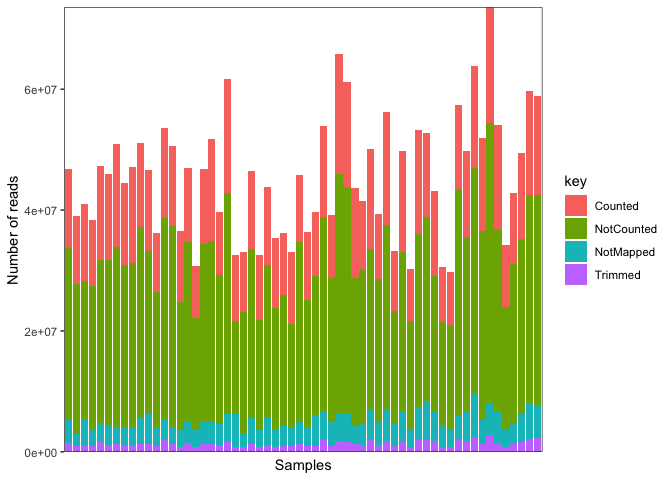<!-- -->

Plot type of coding genes measured

``` r
plotDF <- countDF %>%
  rownames_to_column() %>%
  merge(y    = select(featAnnot, gene_id, gene_biotype),
        by.x = "rowname",
        by.y = "gene_id") %>%
  gather(sample, value, -rowname, -gene_biotype) %>%
  group_by(sample, gene_biotype) %>%
  summarize(eta = sum(value),
            mu  = mean(value),
            q2  = median(value))
 
ggplot(data = plotDF,
                   mapping = aes(x = sample, y = eta, fill = gene_biotype)) +
  geom_bar(stat = "identity") +
  scale_y_continuous(expand = c(0, 0)) +
  labs(x = "Samples", y = "Number of reads") +
  theme_bw() +
  theme(axis.text.x = element_blank(),
        axis.ticks.x = element_blank(),
        panel.grid.major = element_blank(),
        panel.grid.minor = element_blank())
```

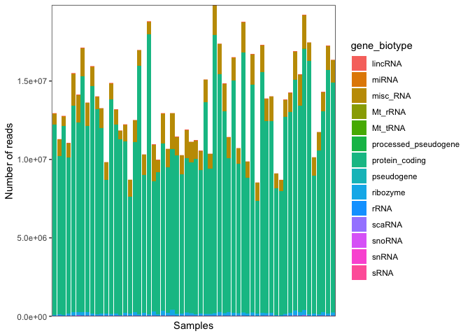<!-- --> MDS plot on raw counts

``` r
rawMat <- counts(esetRaw)
mat <- rawMat[rowSums(rawMat) > 0, ]
mat <- log2(mat + 0.25)
distMat <- dist(t(mat))
fit <- cmdscale(distMat, k = 2, eig = TRUE)
plotDF <- as.data.frame(fit$points)
plotDF <- plotDF %>%
  rownames_to_column() %>%
  merge(x = pData(esetRaw),
        by.y = "rowname",
        by.x = "sampleID")

ggplot(data    = plotDF,
                   mapping = aes(x     = V1,
                                 y     = V2,
                                 label = sampleID,
                                 color = TotalReads,
                                 shape = timePoint)) +
  geom_point(size = 4) +
  labs(x = paste0("1st dimension (",
                        round((fit$eig/sum(fit$eig))[1] * 100),
                        "%)"),
                    y = paste0("2nd dimension (",
                        round((fit$eig/sum(fit$eig))[2] * 100),
                        "%)")) +
  scale_color_continuous(low = "lightblue", high = "darkblue") +
  theme_bw()
```

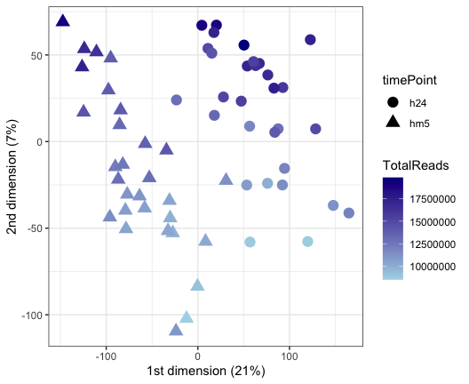<!-- -->

TMM normalization of count data

``` r
dge <- DGEList(counts       = counts(esetRaw),
               remove.zeros = TRUE)
dge <- calcNormFactors(object = dge, method = "TMM")
normalizedCounts <- cpm(dge, normalized.lib.sizes = TRUE, log = TRUE)
normalizedCounts <- round(normalizedCounts, 0)
eset <-  newSeqExpressionSet(
    counts           = dge$counts,
    normalizedCounts = as.matrix(normalizedCounts),
    featureData      = fData(esetRaw)[rownames(normalizedCounts), ],
    phenoData        = pData(esetRaw))
save(eset, file = file.path(workDir, "output/vb013.eset.RData"))
```

MDS plot on TMM normalized counts

``` r
mat <- normCounts(eset)
distMat <- dist(t(mat))
fit <- cmdscale(distMat, k = 2, eig = TRUE)
plotDF <- as.data.frame(fit$points) %>%
  rownames_to_column() %>%
  merge(x = pData(eset),
        by.x = "sampleID",
        by.y = "rowname")
plotLabel <- round((fit$eig/sum(fit$eig)) * 100)
plotLabel <- plotLabel[1:2]
plotLabel <- paste0(c("1st dimension (", "2nd dimension ("),
                    plotLabel,
                    "%)")
ggplot(data = plotDF,
                   mapping = aes(x = V1,
                                 y = V2,
                                 color = study,
                                 shape = timePoint)) +
  geom_point(size = 4) +
  labs(x = plotLabel[[1]],
       y = plotLabel[[2]]) +
  theme_bw() +
  theme(legend.key = element_blank())
```

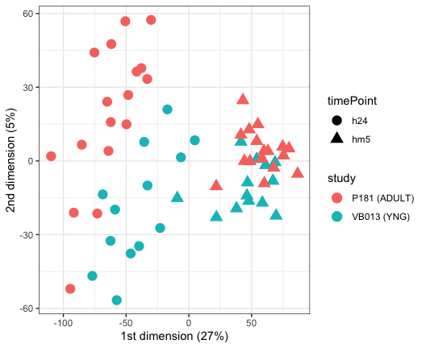<!-- -->

MDS plot only on pre-vax samples

``` r
esetTemp <- eset[, eset$timePoint %in% "hm5"]
mat <- normCounts(esetTemp)
distMat <- dist(t(mat))
fit <- cmdscale(distMat, k = 2, eig = TRUE)
plotDF <- as.data.frame(fit$points) %>%
  rownames_to_column() %>%
  merge(x = pData(eset),
        by.x = "sampleID",
        by.y = "rowname")
plotLabel <- round((fit$eig/sum(fit$eig)) * 100)
plotLabel <- plotLabel[1:2]
plotLabel <- paste0(c("1st dimension (", "2nd dimension ("),
                    plotLabel,
                    "%)")
ggplot(data = plotDF,
                   mapping = aes(x = V1,
                                 y = V2,
                                 color = study,
                                 shape = timePoint)) +
  geom_point(size = 4) +
  labs(x = plotLabel[[1]],
       y = plotLabel[[2]]) +
  theme_bw() +
  theme(legend.key = element_blank())
```

<!-- -->

Create post/pre SeqExpressionSet

``` r
flagDF <- pData(eset) %>%
  select(`ANIMAL ID`, timePoint, sampleID) %>%
  spread(timePoint, sampleID)

esetBaselined <- eset[, flagDF$h24]
normCounts(esetBaselined) <- normCounts(esetBaselined) -
  normCounts(eset)[, flagDF$hm5]
save(esetBaselined, file = file.path(workDir, "output/vb013.esetBaselined.RData"))
```

Differential expression using edgeR and LIMMA

``` r
fits <- fits2 <- list()
# vaccine effect
group <- pData(eset) %>%
  mutate(study  = gsub(pattern = "^([^ ]+).+",
                       replacement = "\\1",
                       study),
         time  = c(h24 = "post", hm5 = "pre")[timePoint],
         group = interaction(study, time)) %>%
  .$group
designMat <- model.matrix(~0 + group)
rownames(designMat) <- sampleNames(eset)
colnames(designMat) <- gsub(pattern     = "group",
                            replacement = "",
                            colnames(designMat))
attr(designMat, "assign") <- attr(designMat, "contrasts") <- NULL
suppressMessages(dgeTemp <- DGEList(counts       = counts(eset),
                                    remove.zeros = TRUE))
dgeTemp <- calcNormFactors(object = dgeTemp, method = "TMM")
dgeTemp <- estimateGLMCommonDisp(y = dgeTemp, design = designMat)
dgeTemp <- estimateGLMTrendedDisp(y = dgeTemp, design = designMat)
dgeTemp <- estimateGLMTagwiseDisp(y = dgeTemp, design = designMat)
fit <- glmFit(y = dgeTemp, design = designMat)
fit$genes <- fData(eset)[rownames(fit$coef), ]
contrastLS <- c("VB013.post-VB013.pre", "P181.post-P181.pre")
contrast <-  makeContrasts(contrasts = contrastLS, levels = fit$design)
fit$contrast <- contrast
fits[["vax"]] <- list(fit = fit)

# vaccine effect (paired)
time <- c(hm5 = "pre",
          h24 = "post")[eset$timePoint]
donor <- factor(make.names(eset$"ANIMAL ID"))
designMat <- model.matrix(~0 + time + donor)
rownames(designMat) <- sampleNames(eset)
colnames(designMat) <- gsub(pattern     = "time",
                            replacement = "",
                            colnames(designMat))
attr(designMat, "assign") <- attr(designMat, "contrasts") <- NULL
suppressMessages(dgeTemp <- DGEList(counts       = counts(eset),
                                    remove.zeros = TRUE))
dgeTemp <- calcNormFactors(object = dgeTemp, method = "TMM")
dgeTemp <- estimateGLMCommonDisp(y = dgeTemp, design = designMat)
dgeTemp <- estimateGLMTrendedDisp(y = dgeTemp, design = designMat)
dgeTemp <- estimateGLMTagwiseDisp(y = dgeTemp, design = designMat)
fit <- glmFit(y = dgeTemp, design = designMat)
fit$genes <- fData(eset)[rownames(fit$coef), ]
contrast <-  makeContrasts(contrasts = "post-pre", levels = fit$design)
fit$contrast <- contrast
fits[["vax_paired"]] <- list(fit = fit)

# age effect
fit <- fits[["vax"]][["fit"]]
contrastLS <- c("P181.pre-VB013.pre", "P181.post-VB013.post")
contrast <-  makeContrasts(contrasts = contrastLS, levels = fit$design)
fit$contrast <- contrast
fits[["age"]] <- list(fit = fit)

# age on baselined expression
study <- gsub(pattern = "^([^ ]+).+",
              replacement = "\\1",
              esetBaselined$study)
designMat <- model.matrix(~0 + study)
rownames(designMat) <- sampleNames(esetBaselined)
colnames(designMat) <- gsub(pattern     = "study",
                            replacement = "",
                            colnames(designMat))
attr(designMat, "assign") <- attr(designMat, "contrasts") <- NULL
fit <- lmFit(normCounts(esetBaselined),  design = designMat)
contrastMat <- makeContrasts(contrasts = "P181-VB013", levels = fit$design)
fit2 <- contrasts.fit(fit, contrastMat)
fit2 <- eBayes(fit2)
fit2$genes <- fData(esetBaselined)[rownames(fit$coef), ]
fits2[["age_baselined"]] <- list(fit = fit, fit2 = fit2)
 
# challenge by vax and timepoint
for (STUDY in unique(eset$study)) {
  for (TIME in unique(eset$timePoint)) {
    esetTemp <- eset[, eset$study %in% STUDY &
                       eset$timePoint %in% TIME]
    challenge <- esetTemp$"Time of acquisition (TOA)"
    designMat <- model.matrix(~challenge)
    rownames(designMat) <- sampleNames(esetTemp)
    suppressMessages(dgeTemp <- DGEList(counts       = counts(esetTemp),
                                        remove.zeros = TRUE))
    dgeTemp <- calcNormFactors(object = dgeTemp, method = "TMM")
    dgeTemp <- estimateGLMCommonDisp(y = dgeTemp, design = designMat)
    dgeTemp <- estimateGLMTrendedDisp(y = dgeTemp, design = designMat)
    dgeTemp <- estimateGLMTagwiseDisp(y = dgeTemp, design = designMat)
    fit <- glmFit(y = dgeTemp, design = designMat)
    fit$genes <- fData(esetTemp)[rownames(fit$coef), ]
    vax <- gsub(pattern = "^([^ ]+).+", replacement = "\\1", STUDY)
    time <- c(hm5 = "pre",
              h24 = "post")[TIME]
    modelName <- paste0(vax, ".", time, "_challenge")
    fits[[modelName]] <- list(fit = fit)
  }
}

# challenge on baselined expression
for (STUDY in unique(esetBaselined$study)) {
  esetTemp <- esetBaselined[, esetBaselined$study %in% STUDY]
  challenge <- esetTemp$"Time of acquisition (TOA)"
  designMat <- model.matrix(~challenge)
  rownames(designMat) <- sampleNames(esetTemp)
  attr(designMat, "assign") <- attr(designMat, "contrasts") <- NULL
  fit <- lmFit(normCounts(esetTemp),  design = designMat)
  fit2 <- eBayes(fit)
  fit2$genes <- fData(esetTemp)[rownames(fit$coef), ]
  modelName <- gsub(pattern = "^([^ ]+).+",
                    replacement = "\\1_baselined_challenge",
                    STUDY)
  fits2[[modelName]] <- list(fit = fit, fit2 = fit2)
}

# save fits
save(fits, file = file.path(workDir, "output/vb013.fits.RData"))
save(fits2, file = file.path(workDir, "output/vb013.fits2.RData"))
```

``` r
# print number of genes differently expressed
degNbDF <- NULL 
for (modelName in grep("challenge", names(fits), invert = TRUE, value = TRUE)) {
  fit <- fits[[modelName]][["fit"]]
  for (coefName in colnames(fit$contrast)) {
    fit2 <- glmLRT(glmfit = fit, contrast = fit$contrast[, coefName])
    topTags(fit2, n = Inf) %>%
      as.data.frame() %>%
      filter(logCPM > 0 & gene_biotype %in% "protein_coding") %>%
      group_by(sign(logFC)) %>%
      summarize(p     = sum(PValue <= 0.05),
                adj.p = sum(FDR <= 0.05)) %>%
      mutate(modelName = modelName,
             coefficient = coefName) %>%
      rbind(degNbDF) -> degNbDF
  }
}
for (modelName in grep("challenge", names(fits), value = TRUE)) {
  fit <- fits[[modelName]][["fit"]]
  coefName <- colnames(fit$design)[2]
  fit2 <- glmLRT(glmfit = fit, coef = "challenge")
  topTags(fit2, n = Inf) %>%
    as.data.frame() %>%
    filter(logCPM > 0 & gene_biotype %in% "protein_coding") %>%
    group_by(sign(logFC)) %>%
    summarize(p     = sum(PValue <= 0.05),
              adj.p = sum(FDR <= 0.05)) %>%
    mutate(modelName   = modelName,
           coefficient = coefName) %>%
    rbind(degNbDF) -> degNbDF
}

for (modelName in grep("challenge", names(fits2), invert = TRUE, value = TRUE)) {
  fit2 <- fits2[[modelName]][["fit2"]]
  for (coefName in colnames(fit2$contrast)) {
    topTable(fit = fit2, coef = coefName, number = Inf) %>%
      as.data.frame() %>%
      filter(AveExpr > 0 & gene_biotype %in% "protein_coding") %>%
      group_by(sign(logFC)) %>%
      summarize(p     = sum(P.Value <= 0.05),
                adj.p = sum(adj.P.Val <= 0.05)) %>%
      mutate(modelName = modelName,
             coefficient = coefName) %>%
      rbind(degNbDF) -> degNbDF
  }
}

for (modelName in grep("challenge", names(fits2), value = TRUE)) {
  fit2 <- fits2[[modelName]][["fit2"]]
  coefName <- "challenge"
  topTable(fit = fit2, coef = coefName, number = Inf) %>%
    as.data.frame() %>%
    filter(AveExpr > 0 & gene_biotype %in% "protein_coding") %>%
    group_by(sign(logFC)) %>%
    summarize(p     = sum(P.Value <= 0.05),
              adj.p = sum(adj.P.Val <= 0.05)) %>%
    mutate(modelName   = modelName,
           coefficient = coefName) %>%
    rbind(degNbDF) -> degNbDF
}

degNbDF %>%
  gather(cname, n, -modelName, -coefficient, -`sign(logFC)`) %>%
  mutate(`sign(logFC)` = c("-1" = "DN", "1" = "UP")[as.character(`sign(logFC)`)],
         cname         = paste0(cname, `sign(logFC)`)) %>%
  select(-`sign(logFC)`) %>%
  spread(cname, n) %>%
  mutate(p = paste0(pUP, "/", pDN),
         adj.p = paste0(adj.pUP, "/", adj.pDN)) %>%
  select(modelName, coefficient, p, adj.p) %>%
  kable()
```

| modelName                 | coefficient          | p         | adj.p     |
|:--------------------------|:---------------------|:----------|:----------|
| age                       | P181.post-VB013.post | 1752/1987 | 960/779   |
| age                       | P181.pre-VB013.pre   | 702/1150  | 91/110    |
| age_baselined             | P181-VB013           | 1280/125  | 379/8     |
| P181_baselined_challenge  | challenge            | 125/153   | 0/0       |
| P181.post_challenge       | challenge            | 252/230   | 5/2       |
| P181.pre_challenge        | challenge            | 215/224   | 2/2       |
| vax                       | P181.post-P181.pre   | 3916/5549 | 3762/5287 |
| vax                       | VB013.post-VB013.pre | 3304/4665 | 2982/3931 |
| vax_paired                | post-pre             | 4050/6102 | 3943/5923 |
| VB013_baselined_challenge | challenge            | 60/289    | 0/1       |
| VB013.post_challenge      | challenge            | 225/184   | 1/5       |
| VB013.pre_challenge       | challenge            | 186/121   | 1/1       |

``` r
for (modelName in grep(pattern = "challenge",
                       names(fits),
                       value   = TRUE,
                       invert  = TRUE)) {
  fit <- fits[[modelName]][["fit"]]
  for (coefName in colnames(fit$contrast)) {
    fit2 <- glmLRT(glmfit = fit, contrast = fit$contrast[, coefName])
    top <- topTags(fit2, n = Inf) %>%
      as.data.frame() %>%
      filter(logCPM > 0 & gene_biotype %in% "protein_coding") %>%
      top_n(50, wt = LR) %>%
      arrange(desc(logFC)) %>%
      mutate(gene_name = ifelse(test = is.na(gene_name),
                                yes  = gene_id,
                                no   = gene_name))
    sampleLS <- which(fit$contrast[, coefName] != 0) %>%
      fit$design[, .] %>%
      as.data.frame() %>%
      rownames_to_column() %>%
      gather(group, value, -rowname) %>%
      group_by(rowname) %>%
      summarize(value = sum(value)) %>%
      filter(value > 0) %>%
      .$rowname
    mat <- normCounts(eset)[top$gene_id, sampleLS] %>%
      t() %>%
      scale() %>%
      t()
    colorLS <- colorRampPalette(colors = c("blue", "white", "red"))(n = 100)
    breakLS <- c(-1 * max(abs(mat)),
                 seq(from = -1 * min(abs(range(mat))),
                     to   = min(abs(range(mat))),
                     length.out = 99),
                 max(abs(mat)))
    matAnnot <- pData(eset)[sampleLS,  ] %>%
      select(VACCINE, study, `Time of acquisition (TOA)`)
    pheatmap(mat            = mat,
             color          = colorLS,
             breaks         = breakLS,
             cellwidth      = 6,
             cellheight     = 6,
             cluster_rows   = FALSE,
             annotation_col = matAnnot,
             main           = paste0(modelName, ": ", coefName),
             fontsize       = 6,
             labels_row     = top$gene_name)
  }
}
```

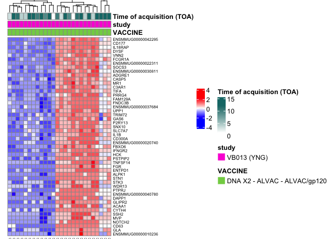<!-- -->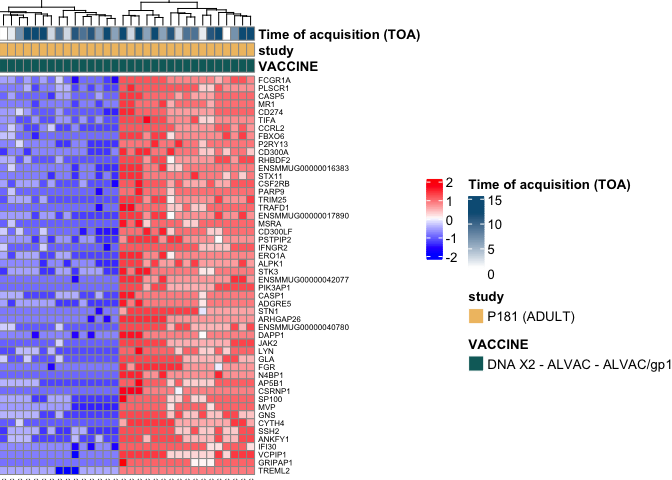<!-- -->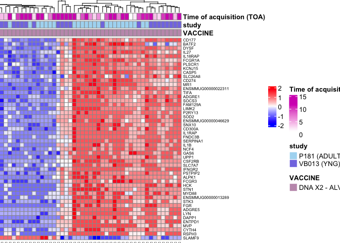<!-- -->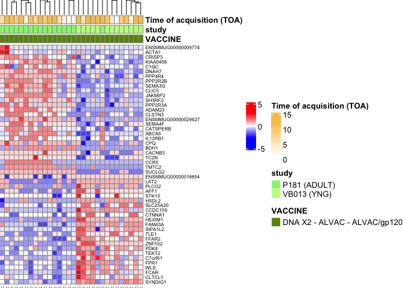<!-- -->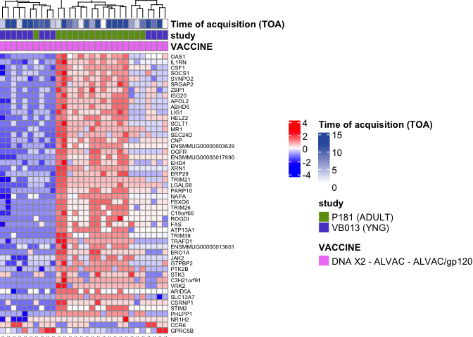<!-- -->

``` r
for (modelName in grep(pattern = "challenge", names(fits), value = TRUE)) {
  fit <- fits[[modelName]][["fit"]]
  fit2 <- glmLRT(glmfit = fit, coef = "challenge")
  top <- topTags(fit2, n = Inf) %>%
    as.data.frame() %>%
    filter(logCPM > 0 & gene_biotype %in% "protein_coding") %>%
    top_n(50, wt = LR) %>%
    arrange(desc(logFC)) %>%
    mutate(gene_name = ifelse(test = is.na(gene_name),
                              yes  = gene_id,
                              no   = gene_name))
  sampleLS <- rownames(fit$design)
  mat <- normCounts(eset)[top$gene_id, sampleLS] %>%
    t() %>%
    scale() %>%
    t()
  meanRank <- apply(mat * sign(top$logFC), MARGIN = 1, FUN = rank) %>%
    rowMeans()
  colorLS <- colorRampPalette(colors = c("blue", "white", "red"))(n = 100)
  breakLS <- c(-1 * max(abs(mat)),
                 seq(from = -1 * min(abs(range(mat))),
                     to   = min(abs(range(mat))),
                     length.out = 99),
                 max(abs(mat)))
  matAnnot <- pData(eset)[sampleLS,  ] %>%
      select(VACCINE, study, `Time of acquisition (TOA)`)
  pheatmap(mat            = mat[, order(meanRank)],
           color          = colorLS,
           breaks         = breakLS,
           cellwidth      = 6,
           cellheight     = 6,
           cluster_rows   = FALSE,
           cluster_cols   = FALSE,
           annotation_col = matAnnot,
           main           = modelName,
           fontsize       = 6,
           labels_row     = top$gene_name)
}
```

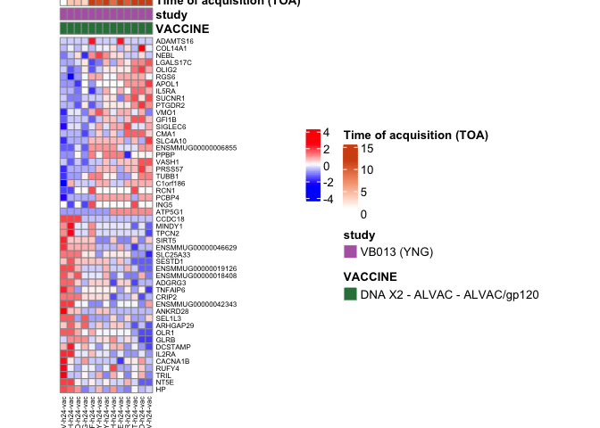<!-- --><!-- -->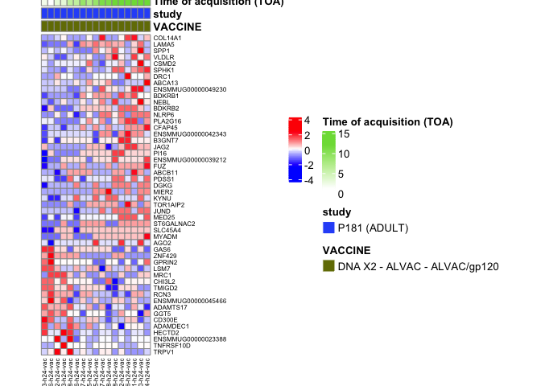<!-- -->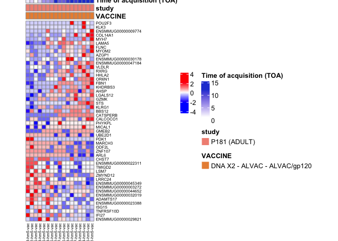<!-- -->

``` r
for (modelName in grep(pattern = "challenge",
                       names(fits),
                       value   = TRUE,
                       invert  = TRUE)) {
  fit <- fits[[modelName]][["fit"]]
  for (coefName in colnames(fit$contrast)) {
    fit2 <- glmLRT(glmfit = fit, contrast = fit$contrast[, coefName])
    top <- topTags(fit2, n = Inf, p.value = 0.05) %>%
      as.data.frame() %>%
      filter(logCPM > 0 & gene_biotype %in% "protein_coding")
    if (nrow(top) > 0) {
      top <- top %>%
        arrange(desc(logFC)) %>%
        mutate(gene_name = ifelse(test = is.na(gene_name),
                                  yes  = gene_id,
                                  no   = gene_name))
      sampleLS <- which(fit$contrast[, coefName] != 0) %>%
        fit$design[, .] %>%
        as.data.frame() %>%
        rownames_to_column() %>%
        gather(group, value, -rowname) %>%
        group_by(rowname) %>%
        summarize(value = sum(value)) %>%
        filter(value > 0) %>%
        .$rowname
      mat <- normCounts(eset)[top$gene_id, sampleLS, drop = FALSE] %>%
        t() %>%
        scale() %>%
        t()
      colorLS <- colorRampPalette(colors = c("blue", "white", "red"))(n = 100)
      breakLS <- c(-1 * max(abs(mat), na.rm = TRUE),
                   seq(from = -1 * min(abs(range(mat, na.rm = TRUE))),
                       to   = min(abs(range(mat, na.rm = TRUE))),
                       length.out = 99),
                   max(abs(mat), na.rm = TRUE))
 matAnnot <- pData(eset)[sampleLS,  ] %>%
      select(VACCINE, study, `Time of acquisition (TOA)`)
 cellHeight <- 6
      labelsRow <- top$gene_name
      if (nrow(top) > 50) {
        cellHeight <- 500/nrow(top)
        rownames(mat) <- NULL
        labelsRow <- NULL
      }
      pheatmap(mat            = mat,
               color          = colorLS,
               breaks         = breakLS,
               cellwidth      = 6,
               cellheight     = cellHeight,
               cluster_rows   = FALSE,
               annotation_col = matAnnot,
               main           = paste0(modelName, ": ", coefName),
               fontsize       = 6,
               labels_row     = labelsRow)
    }
  }
}
```

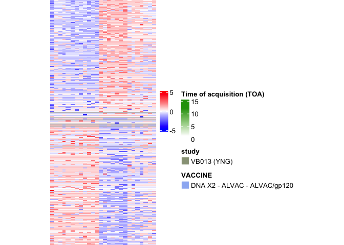<!-- --><!-- --><!-- -->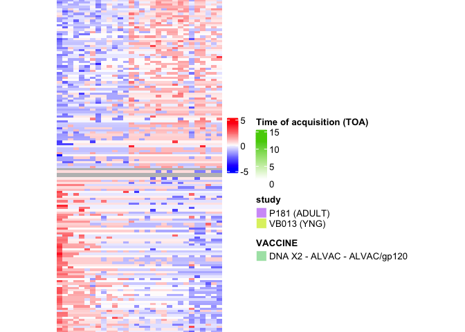<!-- --><!-- -->

``` r
for (modelName in grep(pattern = "challenge", names(fits), value = TRUE)) {
  fit <- fits[[modelName]][["fit"]]
  fit2 <- glmLRT(glmfit = fit, coef = "challenge")
  top <- topTags(fit2, n = Inf, p.value = 0.05) %>%
    as.data.frame() %>%
    filter(logCPM > 0 & gene_biotype %in% "protein_coding") 
  
  if (nrow(top) > 0) {
    top <- top %>%
      arrange(desc(logFC)) %>%
      mutate(gene_name = ifelse(test = is.na(gene_name),
                                yes  = gene_id,
                                no   = gene_name))
    sampleLS <- rownames(fit$design)
    mat <- normCounts(eset)[top$gene_id, sampleLS, drop = FALSE] %>%
    t() %>%
    scale() %>%
    t()
    meanRank <- apply(mat * sign(top$logFC), MARGIN = 1, FUN = rank) %>%
      rowMeans()
    colorLS <- colorRampPalette(colors = c("blue", "white", "red"))(n = 100)
    breakLS <- c(-1 * max(abs(mat)),
                 seq(from = -1 * min(abs(range(mat))),
                     to   = min(abs(range(mat))),
                     length.out = 99),
                 max(abs(mat)))
 matAnnot <- pData(eset)[sampleLS,  ] %>%
      select(VACCINE, study, `Time of acquisition (TOA)`)
 pheatmap(mat            = mat[, order(meanRank), drop = FALSE],
           color          = colorLS,
           breaks         = breakLS,
           cellwidth      = 6,
           cellheight     = 6,
           cluster_rows   = FALSE,
           cluster_cols   = FALSE,
           annotation_col = matAnnot,
           main           = modelName,
           fontsize       = 6,
           labels_row     = top$gene_name)
  }
}
```

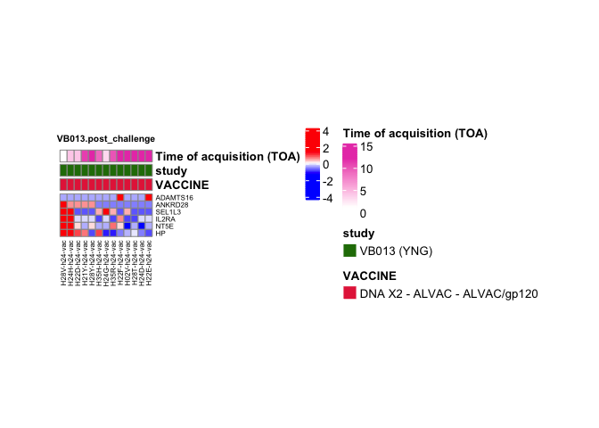<!-- --><!-- -->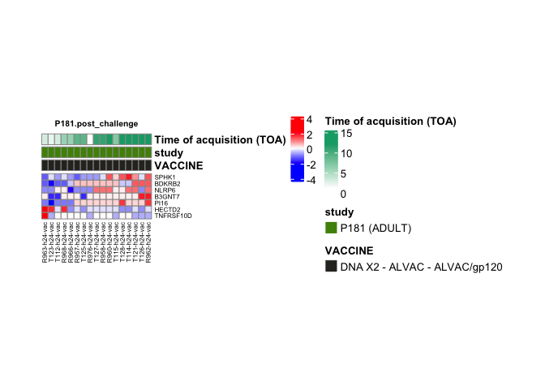<!-- -->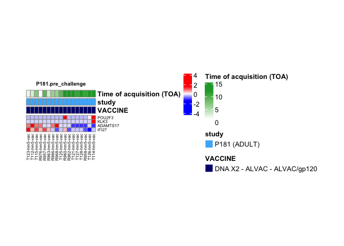<!-- -->

``` r
modelName <- "vax"
fit <- fits[[modelName]][["fit"]]
contrastLS <- grep(pattern = "Control.+Control",
                   colnames(fit$contrast),
                   invert = TRUE,
                   value  = TRUE)
fit2 <- glmLRT(glmfit = fit, contrast = fit$contrast[, contrastLS])
top <- topTags(fit2, n = Inf, p.value = 0.05) %>%
  as.data.frame() %>%
  filter(logCPM > 0 & gene_biotype %in% "protein_coding")
top <- top %>%
  arrange(desc(LR)) %>%
  mutate(gene_name = ifelse(test = is.na(gene_name),
                            yes  = gene_id,
                            no   = gene_name))
sampleLS <- which(rowSums(fit$contrast[, contrastLS] != 0) > 0) %>%
  fit$design[, .] %>%
  as.data.frame() %>%
  rownames_to_column() %>%
  gather(group, value, -rowname) %>%
  group_by(rowname) %>%
  summarize(value = sum(value)) %>%
  filter(value > 0) %>%
  .$rowname
mat <- normCounts(eset)[top$gene_id, sampleLS, drop = FALSE] %>%
  t() %>%
  scale() %>%
  t()
mat <- mat[rowMeans(is.na(mat)) < 0.8, ]
colorLS <- colorRampPalette(colors = c("blue", "white", "red"))(n = 100)
breakLS <- c(-1 * max(abs(mat), na.rm = TRUE),
             seq(from = -1 * min(abs(range(mat, na.rm = TRUE))),
                 to   = min(abs(range(mat, na.rm = TRUE))),
                 length.out = 99),
             max(abs(mat), na.rm = TRUE))
matAnnot <- pData(eset)[sampleLS,  ] %>%
      select(VACCINE, study, `Time of acquisition (TOA)`)
cellHeight <- 250/nrow(top)
rownames(mat) <- NULL
labelsRow <- NULL
pheatmap(mat            = mat,
         color          = colorLS,
         breaks         = breakLS,
         cellwidth      = 2,
         cellheight     = cellHeight,
         annotation_col = matAnnot,
         main           = paste0(modelName, ": F"),
         fontsize       = 6,
         show_rownames = FALSE,
         show_colnames  = FALSE)
```

<!-- -->
