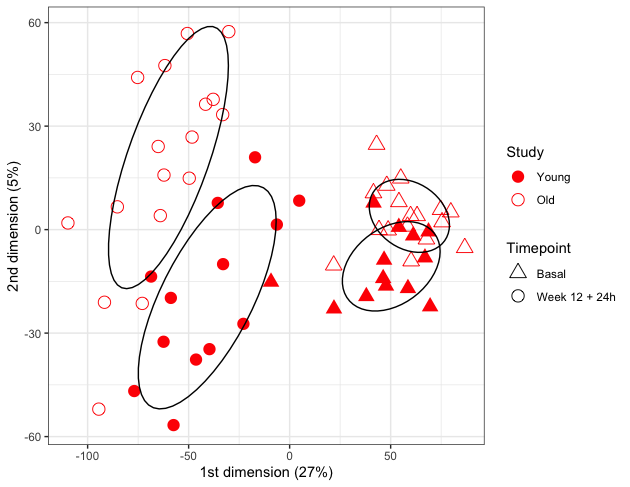

VB013: MDS of normalized RNASeq
================
Slim Fourati
November 7, 2020

``` r
suppressPackageStartupMessages(library(package = "knitr"))
suppressPackageStartupMessages(library(package = "readxl"))
suppressPackageStartupMessages(library(package = "EDASeq"))
suppressPackageStartupMessages(library(package = "edgeR"))
suppressPackageStartupMessages(library(package = "tidyverse"))
```

``` r
workDir <- dirname(getwd())
opts_chunk$set(tidy = FALSE, fig.path = "../figure/")
```

# Load SeqExpressionSet

``` r
load(file = file.path(workDir, "output/vb013.eset.RData"))
```

``` r
mat <- normCounts(eset)
distMat <- dist(t(mat))
fit <- cmdscale(distMat, k = 2, eig = TRUE)
plotDF <- as.data.frame(fit$points) %>%
  rownames_to_column() %>%
  merge(x = pData(eset),
        by.x = "sampleID",
        by.y = "rowname") %>%
    mutate(study = recode(study, 
                          "P181 (ADULT)" = "Old",
                          "VB013 (YNG)"  = "Young"),
           study = factor(study,
                          levels = c("Young", "Old")),
           timePoint = recode(timePoint,
                              "hm5" = "Basal",
                              "h24" = "Week 12 + 24h"))
plotLabel <- round((fit$eig/sum(fit$eig)) * 100)
plotLabel <- plotLabel[1:2]
plotLabel <- paste0(c("1st dimension (", "2nd dimension ("),
                    plotLabel,
                    "%)")
ggplot(data    = plotDF,
       mapping = aes(x     = V1,
                     y     = V2)) +
    geom_point(mapping = aes(color = study,
                             fill  = study,
                             shape = timePoint), 
               size = 4) +
    stat_ellipse(level = 0.65,
                 mapping = aes(group = interaction(study, timePoint))) +
    labs(x = plotLabel[[1]],
         y = plotLabel[[2]]) +
    scale_color_manual(name = "Study",
                       values = c("Old" = "red",
                                  "Young" = "transparent")) +
    scale_shape_manual(name = "Timepoint", 
                       values = c("Basal" = 24, "Week 12 + 24h" = 21)) +
    scale_fill_manual(name = "Study",
                      values = c("Old" = "transparent",
                                  "Young" = "red")) +
    theme_bw() +
    theme(legend.key = element_blank()) +
    guides(fill = guide_legend(override.aes = list(shape = 21)))
```

<!-- -->

``` r
sessionInfo()
```

    ## R version 4.2.2 (2022-10-31)
    ## Platform: x86_64-apple-darwin20.6.0 (64-bit)
    ## Running under: macOS Big Sur 11.6
    ## 
    ## Matrix products: default
    ## BLAS:   /usr/local/Cellar/openblas/0.3.21/lib/libopenblasp-r0.3.21.dylib
    ## LAPACK: /usr/local/Cellar/r/4.2.2_1/lib/R/lib/libRlapack.dylib
    ## 
    ## locale:
    ## [1] en_US.UTF-8/en_US.UTF-8/en_US.UTF-8/C/en_US.UTF-8/en_US.UTF-8
    ## 
    ## attached base packages:
    ## [1] stats4    stats     graphics  grDevices utils     datasets  methods  
    ## [8] base     
    ## 
    ## other attached packages:
    ##  [1] forcats_0.5.2               stringr_1.5.0              
    ##  [3] dplyr_1.0.10                purrr_1.0.0                
    ##  [5] readr_2.1.3                 tidyr_1.2.1                
    ##  [7] tibble_3.1.8                ggplot2_3.4.0              
    ##  [9] tidyverse_1.3.2             edgeR_3.38.4               
    ## [11] limma_3.52.4                EDASeq_2.30.0              
    ## [13] ShortRead_1.54.0            GenomicAlignments_1.32.1   
    ## [15] SummarizedExperiment_1.26.1 MatrixGenerics_1.8.1       
    ## [17] matrixStats_0.63.0          Rsamtools_2.12.0           
    ## [19] GenomicRanges_1.48.0        Biostrings_2.64.1          
    ## [21] GenomeInfoDb_1.32.4         XVector_0.36.0             
    ## [23] IRanges_2.30.1              S4Vectors_0.34.0           
    ## [25] BiocParallel_1.30.4         Biobase_2.56.0             
    ## [27] BiocGenerics_0.42.0         readxl_1.4.1               
    ## [29] knitr_1.41                 
    ## 
    ## loaded via a namespace (and not attached):
    ##   [1] googledrive_2.0.0      colorspace_2.0-3       rjson_0.2.21          
    ##   [4] deldir_1.0-6           hwriter_1.3.2.1        ellipsis_0.3.2        
    ##   [7] fs_1.5.2               rstudioapi_0.14        farver_2.1.1          
    ##  [10] bit64_4.0.5            AnnotationDbi_1.58.0   fansi_1.0.3           
    ##  [13] lubridate_1.9.0        xml2_1.3.3             codetools_0.2-18      
    ##  [16] R.methodsS3_1.8.2      cachem_1.0.6           jsonlite_1.8.4        
    ##  [19] broom_1.0.2            dbplyr_2.2.1           png_0.1-8             
    ##  [22] R.oo_1.25.0            compiler_4.2.2         httr_1.4.4            
    ##  [25] backports_1.4.1        assertthat_0.2.1       Matrix_1.5-3          
    ##  [28] fastmap_1.1.0          gargle_1.2.1           cli_3.5.0             
    ##  [31] htmltools_0.5.4        prettyunits_1.1.1      tools_4.2.2           
    ##  [34] gtable_0.3.1           glue_1.6.2             GenomeInfoDbData_1.2.8
    ##  [37] rappdirs_0.3.3         Rcpp_1.0.9             cellranger_1.1.0      
    ##  [40] vctrs_0.5.1            rtracklayer_1.56.1     xfun_0.36             
    ##  [43] rvest_1.0.3            timechange_0.1.1       lifecycle_1.0.3       
    ##  [46] restfulr_0.0.15        XML_3.99-0.13          googlesheets4_1.0.1   
    ##  [49] MASS_7.3-58.1          zlibbioc_1.42.0        scales_1.2.1          
    ##  [52] aroma.light_3.26.0     hms_1.1.2              parallel_4.2.2        
    ##  [55] RColorBrewer_1.1-3     yaml_2.3.6             curl_4.3.3            
    ##  [58] memoise_2.0.1          biomaRt_2.52.0         latticeExtra_0.6-30   
    ##  [61] stringi_1.7.8          RSQLite_2.2.20         highr_0.10            
    ##  [64] BiocIO_1.6.0           GenomicFeatures_1.48.4 filelock_1.0.2        
    ##  [67] rlang_1.0.6            pkgconfig_2.0.3        bitops_1.0-7          
    ##  [70] evaluate_0.19          lattice_0.20-45        labeling_0.4.2        
    ##  [73] bit_4.0.5              tidyselect_1.2.0       magrittr_2.0.3        
    ##  [76] R6_2.5.1               generics_0.1.3         DelayedArray_0.22.0   
    ##  [79] DBI_1.1.3              withr_2.5.0            pillar_1.8.1          
    ##  [82] haven_2.5.1            KEGGREST_1.36.3        RCurl_1.98-1.9        
    ##  [85] modelr_0.1.10          crayon_1.5.2           interp_1.1-3          
    ##  [88] utf8_1.2.2             BiocFileCache_2.4.0    tzdb_0.3.0            
    ##  [91] rmarkdown_2.19         jpeg_0.1-10            progress_1.2.2        
    ##  [94] locfit_1.5-9.7         grid_4.2.2             blob_1.2.3            
    ##  [97] reprex_2.0.2           digest_0.6.31          R.utils_2.12.2        
    ## [100] munsell_0.5.0
